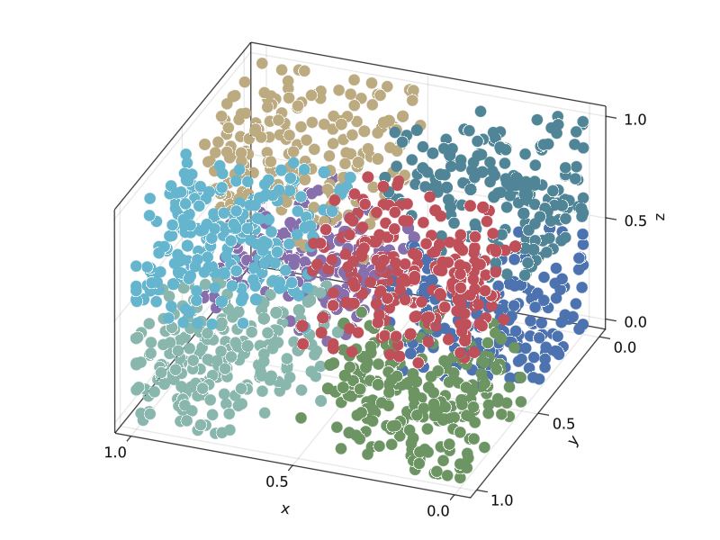

# ParameterSpacePartitions

Parameter space partitioning is a model assessment method for mapping qualitative predictions to regions of the parameter space. The parameter space is explored with an MCMC chains. A new chain is created for each newly discovered pattern. Proposals are sampled uniformly from the surface of a hyperspere with the same number of dimensions as the parameter space. 

# Example

In this simple example, parameter space partitioning is applied to a cube with regions of equal volume.
## Load Dependencies

The first step is to load dependences.
```julia
using Distributions, ParameterSpacePartitions
using Random, DataFrames
```

## Model Function 

Next, we define a model that accepts a vector of parameters and returns data predictions. In this simple example, the model returns the parameter inputs.

```julia 
model(parms) = parms 
```
## Pattern Function

A second function categorizes the predicted data into a qualitative pattern. At minimum, the pattern function must recieve a data input. In this example, the pattern function also recieves `p_bounds` which represents the partition boundaries of a given dimension. `p_fun` categorizes `data` on each dimension and returns a vector, such as `[1,3,1]`, which indicates the data is in the partition that is 1 in the x axis, 3 on the y axis and 1 on the z axis. 

```julia
function p_fun(data, p_bounds)
    nb = length(p_bounds)
    nd = length(data)
    vals = fill(-100, nd)
    for j in 1:nd
        for i in 1:(nb-1) 
            if (data[j] ≥ p_bounds[i]) && (data[j] ≤ p_bounds[i+1])
                vals[j] = i 
                continue
            end
        end
    end
    return vals
end
```

## Model Configuration

This example is a 3 dimensional cube with 4 partitions per dimension, resulting in 2^3 = 8 regions.


```julia
# dimensions of the hypbercue
n_dims = 3
# partitions per dimension
n_part = 2
```

# Boundaries

In the code below, `bounds` is the upper and lower boundaries for each dimension. In this case, we will use a unit cube. In addition, we must also define `p_bounds`, which is the boundaries for each partition on each dimension. The partitions are equally spaced along each dimension of the unit cube.

```julia
# partition boundaries
bounds = fill((0, 1), n_dims)
p_bounds = range(0, 1, n_part + 1)
```

## Starting Points
The algorim requires a starting point to begin exploring the parameter space. The starting points must be wrapped in a vector. The starting points are sampled uniformly within the unit cube, using `bounds` to ensure the starting point is within allowable ranges. Although one starting point is sufficient for the present example, seeding the algorithm with multiple starting points can improve performance. 

```julia 
# number of starting points
n_start = 1
# sample function
sample(bounds) = map(b -> rand(Uniform(b...)), bounds)
# initial starting points
init_parms = map(_ -> sample(bounds), 1:n_start)
```

## Option Configuration

We can configure options to define and improve the performance of the algorithm. The search radius is an important configuration. The challenge is to balance the tradeoff between exploration and exploitation. If the radius is too small, it will stay in one region (or a sub-space of a region), and will fail to find new regions. By contrast, if the radius is too large, many regions will be found, but will not be well defined. Pitt et al. noted that an acceptance rate of 20% may work well in many cases, but this is a heuristic rather than a hard requirement. The options also stores the bounds and initial parameters. Threading can be enabled by setting `parallel=true`. Some exploration revealed that threading becomes advantageous once the evaluation time reaches 1 millisecond or longer. Otherwise, threading overhead will reduce the speed of the algorithm. 

```julia
options = Options(;
    radius = .20,
    bounds,
    n_iters = 100,
    parallel = false,
    init_parms
)
```
## Find Partitions 

Now that the requisite functions and options have been specified, we can now explore the parameter space.
The function `find_partitions` accepts the `model` function, the pattern function `p_fun`, the options object and returns the results.

```julia
results = find_partitions(
    model, 
    x -> p_fun(x, p_bounds), 
    options
)
```

`results` is a vector of `Results` objects containing the following information:

- `iter`: the iteration of the algorithm
- `chain_id`: an index of the chain, i.e. 2 is the second chain
- `parms`: a vector of parameters
- `pattern`: the target pattern of the chain
- `acceptance`: a vector indicating whether a proposal was accepted. If accepted, `parms` is the accepted proposal. If not accepted, `parms` is the same as the previous iteration.

## Results

To facilitate the analysis, we will convert the results to a `DataFrame` and destructure the parameter vector into individual columns---one per parameter. 

```julia
df = DataFrame(results)
transform!(
    df, 
    :parms => identity => [:p1, :p2, :p3]
)
```

The next code block finds the minimum and maximum of each partition.

```julia
groups = groupby(df, :pattern)
summary = combine(groups, 
    :p1 => minimum, :p1 => maximum, 
    :p2 => minimum, :p2 => maximum,
    :p3 => minimum, :p3 => maximum
) |> sort
```
As shown below, the algorithm found all 64 partitions. In addition, the size of the partition is approximately 1/2 = .50, which is what we expect. 

```julia
8×7 DataFrame
 Row │ pattern    p1_minimum  p1_maximum  p2_minimum  p2_maximum  p3_minimum  p3_maximum 
     │ Array…     Float64     Float64     Float64     Float64     Float64     Float64    
─────┼───────────────────────────────────────────────────────────────────────────────────
   1 │ [1, 1, 1]    0.0         0.48967     0.0         0.499932    0.0         0.49681
   2 │ [1, 1, 2]    0.0         0.495971    0.0         0.499053    0.500689    1.0
   3 │ [1, 2, 1]    0.0         0.483521    0.501788    1.0         0.0         0.497413
   4 │ [1, 2, 2]    0.0         0.498217    0.500802    1.0         0.501422    1.0
   5 │ [2, 1, 1]    0.510802    1.0         0.0         0.499524    0.0         0.497886
   6 │ [2, 1, 2]    0.500576    1.0         0.0         0.492338    0.502256    1.0
   7 │ [2, 2, 1]    0.50373     1.0         0.536216    1.0         0.0         0.492919
   8 │ [2, 2, 2]    0.500171    1.0         0.500525    1.0         0.509783    1.0
  ```

## Visualization

The following code shows how to visualize the results. 

```julia
using GLMakie

# transform pattern into integer id
transform!(df, :pattern => denserank => :pattern_id)

fig, ax, scat = scatter(
    df.p1,
    df.p2,
    df.p3, 
    color = df.pattern_id, 
    axis = (;type=Axis3),
    markersize = 5000,
    colormap = ColorSchemes.seaborn_deep6.colors,
    grid = true
)
```



# References

Pitt, M. A., Kim, W., Navarro, D. J., & Myung, J. I. (2006). Global model analysis by parameter space partitioning. Psychological Review, 113(1), 57.